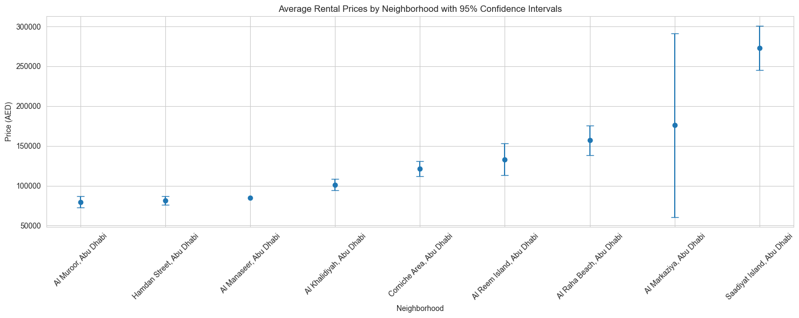

# **StatisticsDubbizle

## Data Description
This data set contains information about rental properties in Abu Dhabi and details about the property.

## Column Names
1. Price
2. Nr Bedrooms 
3. Nr Bathrooms
4. Location
5. Size
6. Unnamed (Size Unit)
7. City

## DATA ANALYSIS:

1. Descriptive Statistics for Price, Nr Bedrooms, Nr Bathrooms and Size

2. Number of properties per location

3. Price Distribution

4. Average Rental Price per Location

5. Price Distribution by Location

6. Q-Q Plot of Rental Prices

7. Price Vs Size

8. Average Rental Prices by Neighborhood
