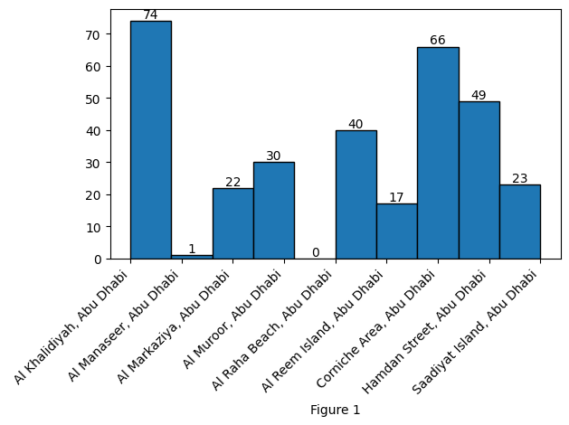
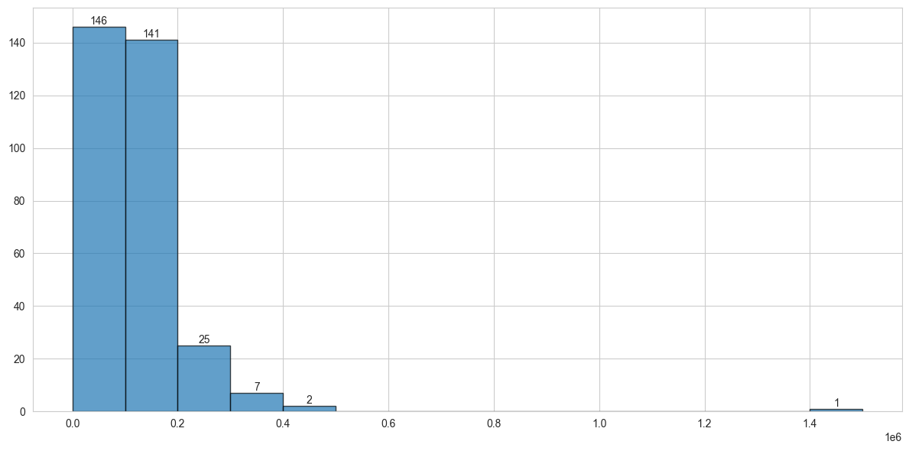
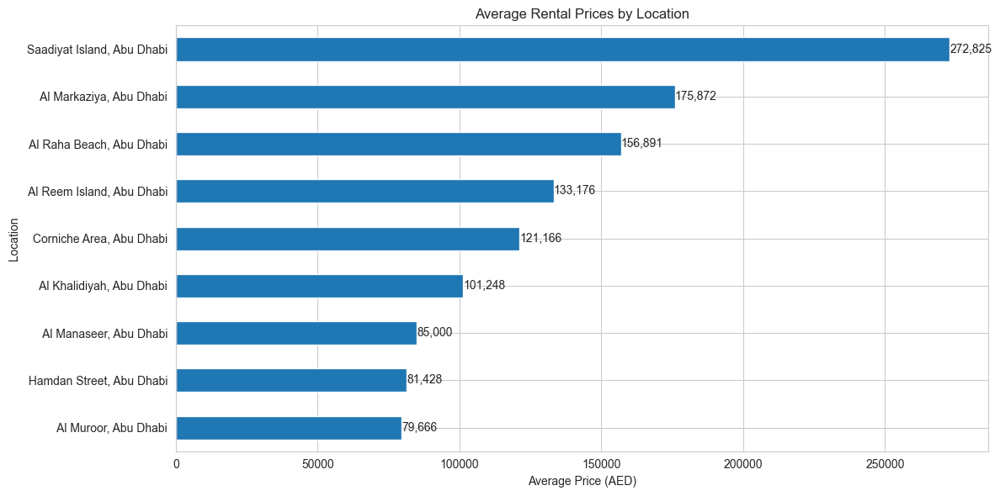
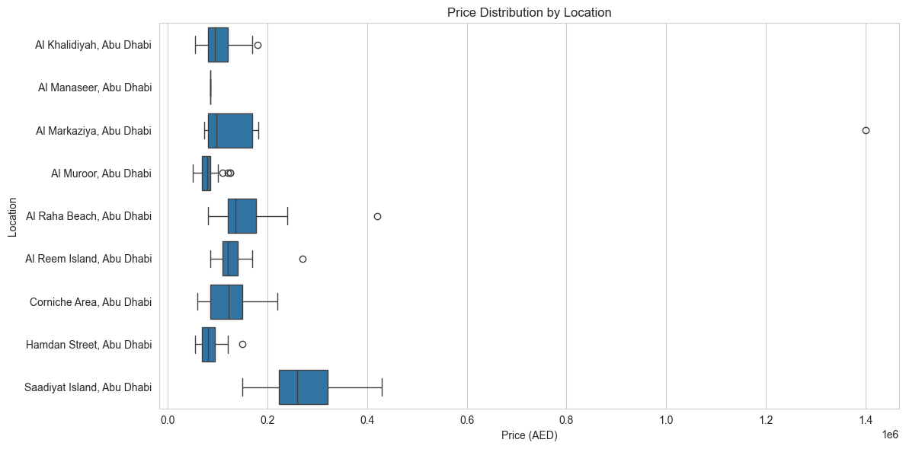
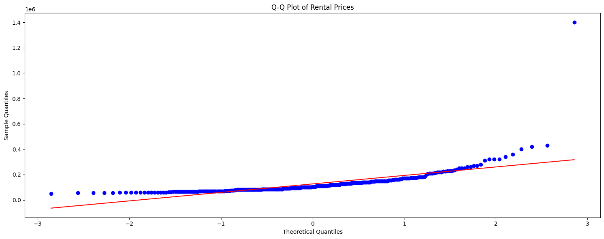
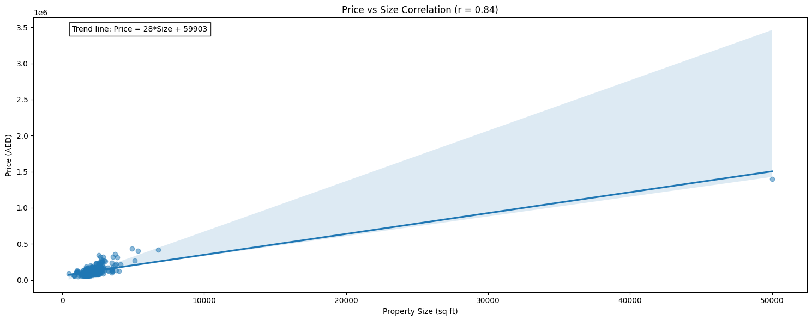
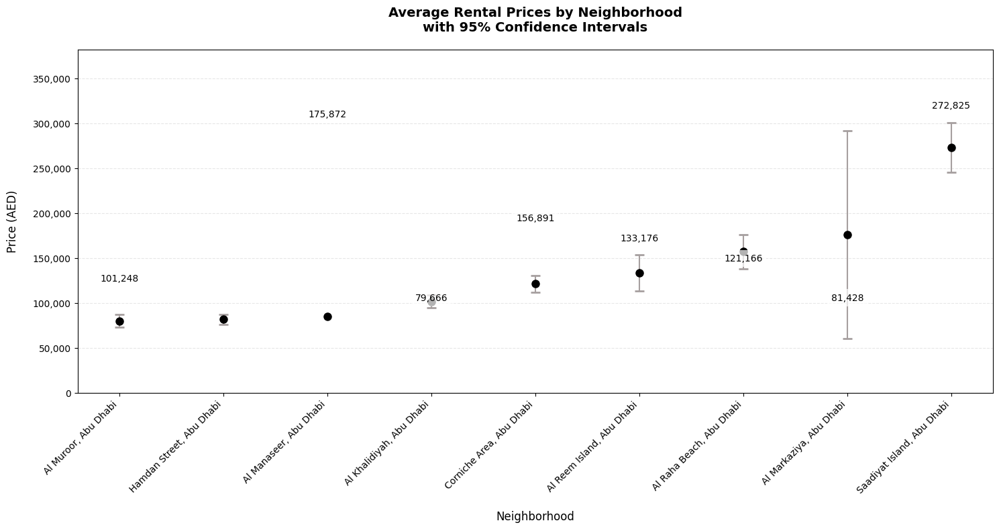
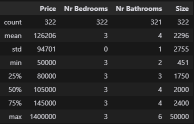

# **StatisticsDubbizle

## Data Description
This data set contains information about rental properties in Abu Dhabi and details about the property.

## Column Names
1. Price
2. Nr Bedrooms 
3. Nr Bathrooms
4. Location
5. Size
6. Unnamed (Size Unit)
7. City

## DATA ANALYSIS:
Figures:

1. Number of properties per location

2. Price Distribution

3. Average Rental Price per Location

4. Price Distribution by Location

5. Q-Q Plot of Rental Prices

6. Price Vs Size

7. Average Rental Prices by Neighborhood

Tables:

1. Descriptive Statistics for Price, Nr Bedrooms, Nr Bathrooms and Size

2. Location Statistics

